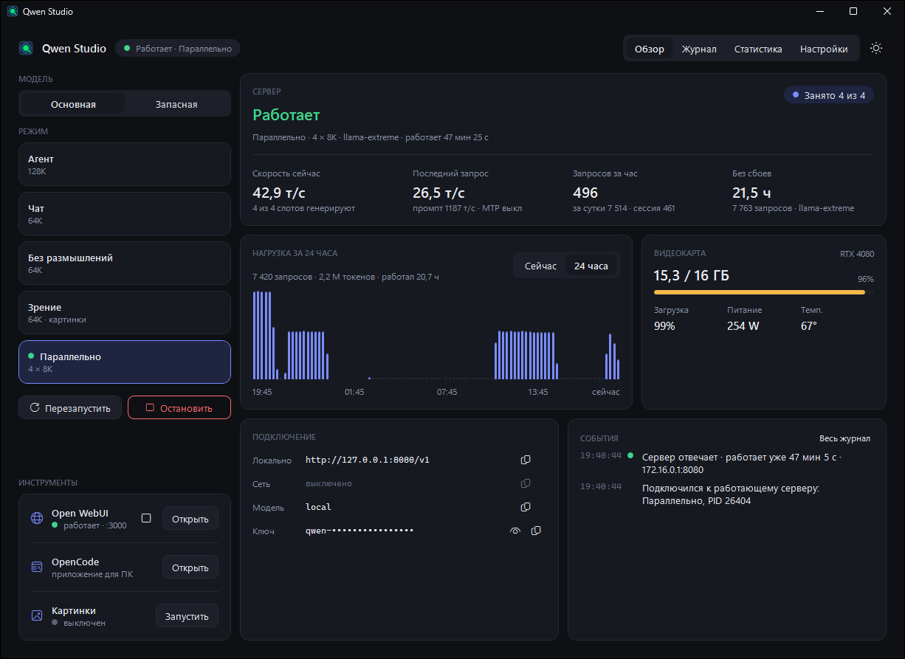

<div align="center">


# Qwen Studio

**Пульт управления локальной LLM на Windows.** Запускает llama.cpp в нужном режиме одной кнопкой,
показывает загрузку видеокарты и скорость, держит рядом Open WebUI, OpenCode и ComfyUI для картинок.

*A one-click control panel for a local llama.cpp server on Windows: modes, live GPU stats, Open WebUI,
OpenCode and ComfyUI. [Full English description below.](#in-english)*

[Возможности](#возможности) · [Быстрый старт](#быстрый-старт) · [Режимы](#режимы) · [Инструменты](#инструменты) · [Настройки](#настройки) · [Вопросы](#частые-вопросы) · [Сборка](#сборка-из-исходников)

Отдельные страницы: [какой llama.cpp скачать](docs/llama-cpp.md) · [как обновить ComfyUI](docs/comfyui.md)

[](https://github.com/danzerzine/qwen-studio/actions/workflows/build.yml)
[](https://github.com/danzerzine/qwen-studio/releases/latest)
[](LICENSE)

**[English version ↓](#in-english)**



</div>

Работает с любой GGUF-моделью: Qwen, Llama, Gemma, Mistral и другими. Название историческое:
Studio вырос вокруг Qwen3.8-27B на видеокарте с 16 ГБ, и режимы по умолчанию подобраны под такую связку.

## Возможности

- **Режимы одной кнопкой.** Агент, чат и параллельные запросы, а под ними тумблеры «Зрение» и
  «Размышления». Режим — это набор аргументов llama-server в `profiles.json`. Переключение перезапускает
  сервер. Если идёт запрос, Studio сначала спросит.
- **Основная, запасная и модель без цензуры.** Любой режим можно запустить на второй модели: например,
  на прошлой проверенной версии, если новая ведёт себя странно. Третий слот — дообученная версия основной
  модели без цензуры.
- **Русский и английский интерфейс.** Язык переключается в «Настройки → Язык» без перезапуска.
- **Видно, что происходит.** Скорость генерации и промпта, занятые слоты, память, загрузка, питание и
  температура видеокарты. Живой график за 5 минут, история за 24 часа и статистика по дням.
- **Видеопамять одна на всех.** Перед стартом Studio выгружает модели Ollama, LM Studio и ComfyUI, чтобы две
  модели не делили одну карту. Если сервер падает с ошибкой CUDA, Studio его перезапускает.
- **Доступ из сети и API-ключ.** Ключ генерируется одной кнопкой, конфиг OpenCode обновляется сам.
  Доступ из локальной сети — переключателем. Правила брандмауэра открывают порты только для частной сети
  и своей подсети.
- **Обновления.** Studio скачивает свежую CUDA-сборку llama.cpp с GitHub в отдельную папку, а текущая
  остаётся на месте. Open WebUI обновляется через `uv`.
- **Мелочи.** Автозапуск вместе с Windows (сервер тоже может стартовать сам), архив старых журналов,
  светлая и тёмная тема в духе Windows 11 ([скриншот светлой](docs/screenshot-light.png)). Закрытие окна
  не останавливает сервер, если вы этого не хотите.

Что на вкладках:

| Вкладка | Что там |
|---|---|
| Обзор | состояние сервера, скорость, график «Сейчас / 24 часа», видеокарта, адрес API и ключ, события |
| Журнал | журнал llama-server в реальном времени; фильтр «Только важное» |
| Статистика | итоги (запросы, токены, часы работы) и таблица по дням за 30 дней |
| Настройки | оформление, автозапуск, пути к сборке и моделям, сеть и брандмауэр, API-ключ, обновления, профили, старые журналы |

## Быстрый старт

Нужно: Windows 10/11 x64, видеокарта NVIDIA и [.NET 8 Desktop Runtime](https://dotnet.microsoft.com/download/dotnet/8.0).

1. **Скачайте** `QwenStudio-win-x64.zip` из [Releases](https://github.com/danzerzine/qwen-studio/releases/latest) и распакуйте в отдельную
   папку. Или соберите сами (см. [сборку](#сборка-из-исходников)). Exe не подписан, поэтому при первом
   запуске Windows SmartScreen может предупредить: «Подробнее» → «Выполнить в любом случае».
2. **Настройки.** В папке уже лежит `server_config.env` с комментариями. Все поля можно заполнить
   и из самого приложения, во вкладке «Настройки».
3. **Модель.** Скачайте GGUF (например, с [Hugging Face](https://huggingface.co/models?library=gguf)) и
   укажите путь в `MODEL_PATH` или в «Настройки → Сервер и модели».
4. **llama.cpp.** В «Настройки → Обновления» нажмите «Проверить», затем «Скачать bNNNN». Studio скачает
   официальную CUDA 12 сборку с [ggml-org/llama.cpp](https://github.com/ggml-org/llama.cpp/releases)
   вместе с библиотеками CUDA, положит её в `llama-bNNNN\` рядом с собой и сам найдёт. Свою сборку можно
   указать в `SERVER_EXE`. Какую сборку выбрать для RTX 50xx, AMD или Intel, как поставить её вручную
   и откатиться — на странице [«Какой llama.cpp скачать»](docs/llama-cpp.md).
5. **Запуск.** Выберите режим слева и нажмите «Запустить». API сервера:
   `http://127.0.0.1:8080/v1`, модель `local`. Это имя задаёт `--alias` в профилях.

Раскладка папки:

```
QwenStudio.exe
profiles.json          режимы сервера
server_config.env      пути, порт, ключ (не публикуйте его)
llama-b1xxxx\          llama.cpp, скачивается из «Обновлений»
models\                модели, если держать их рядом
logs\studio\           журналы сервера, статистика, настройки окна
```

## Режимы

Режимы описаны в `profiles.json`. Их можно менять и добавлять: «Настройки → Обслуживание → Профили →
Изменить», затем «Перечитать».

| Режим | Контекст | Для чего | Зрение |
|---|---|---|---|
| Агент | 128K | OpenCode и другие агенты: длинный контекст, полные размышления | нет: не хватит видеопамяти рядом со 128K |
| Чат | 64K | обычный чат, размышления короче | можно включить |
| Параллельно | 4 × 8K | четыре запроса одновременно: пакетная обработка, несколько клиентов | можно включить |

Под карточками режимов два тумблера:

- **Зрение** подключает модуль зрения модели (`MMPROJ_PATH`, ещё ~1 ГБ видеопамяти): модель понимает
  скриншоты, документы и фото. Тумблер доступен в режимах, где в `profiles.json` задан ключ `mmproj`.
  Ключ `vision` решает, включено ли зрение по умолчанию.
- **Размышления.** Выключенный тумблер добавляет `--reasoning off`: модель отвечает сразу. Это подходит
  для перевода, коротких ответов и пакетных прогонов. Если в шаблоне чата модели нет режима размышлений,
  тумблер неактивен.

Положение тумблеров Studio запоминает для каждого режима отдельно. Если сервер уже работает, новые
настройки применяет кнопка «Применить изменения». Если у вас `profiles.json` из версии 1.2 с отдельными
режимами «Без размышлений» и «Зрение», возьмите новый файл из архива и перенесите в него свои правки.

Переключатель **Основная / Запасная** запускает тот же режим на `FALLBACK_MODEL_PATH` (и
`FALLBACK_SERVER_EXE`, если он задан). Для запасной модели Studio убирает аргументы `--spec-*`,
ограничивает контекст 96K и выключает кэш промпта. Так проще откатиться на старую модель или сборку.

Кнопка **Без цензуры** запускает тот же режим на `UNCENSORED_MODEL_PATH`. Это должна быть дообученная
версия основной модели той же архитектуры: сервер, MTP и аргументы остаются как у основной, меняются
только веса. Пока путь не задан, кнопка неактивна.

Значения по умолчанию (`-ctk/-ctv q4_0`, `-ngl 999`, `--fit off`) рассчитаны на модель ~27B в Q3/IQ4
на карте с 16 ГБ. Для другой связки подберите `ctx`, тип KV-кэша и `-np`. Если модель и сборка
llama.cpp поддерживают MTP, добавьте в `args` `"--spec-type", "draft-mtp", "--spec-draft-n-max", "1"`:
это ускоряет генерацию.

## Инструменты

### Open WebUI — чат в браузере

```bash
uv tool install --python 3.11 open-webui
```

Studio ищет `%USERPROFILE%\.local\bin\open-webui.exe` (туда его ставит `uv`) и запускает его на
`WEBUI_PORT` (3000), уже подключённым к серверу и с текущим API-ключом. Кнопка «Открыть» поднимает
WebUI и открывает браузер. После смены ключа Studio сам пропишет новый ключ в настройки WebUI.

### OpenCode — агент для кода

Поставьте [OpenCode](https://opencode.ai): приложение для ПК или `npm i -g opencode-ai`. Studio
откроет то, что найдёт. Подключение к локальному серверу в `%USERPROFILE%\.config\opencode\opencode.jsonc`:

```jsonc
{
  "$schema": "https://opencode.ai/config.json",
  "provider": {
    "local": {
      "npm": "@ai-sdk/openai-compatible",
      "name": "Qwen Studio",
      "options": { "baseURL": "http://127.0.0.1:8080/v1", "apiKey": "ваш LLAMA_API_KEY" },
      "models": { "local": { "name": "Локальная модель" } }
    }
  }
}
```

Когда вы меняете ключ в Studio, он заменяется и в этом файле. Старая версия файла сохраняется рядом.

### Картинки — ComfyUI

1. Скачайте портативный [ComfyUI](https://github.com/comfyanonymous/ComfyUI/releases) и распакуйте.
2. Укажите папку в «Настройки → Сервер и модели → ComfyUI» (или `COMFYUI_DIR`). Подойдёт и git-установка
   с `venv`.
3. Модель картинок (Qwen-Image, FLUX, SDXL…) ставится через шаблоны самого ComfyUI.

Studio запускает ComfyUI на порту 8188 и открывает его в браузере. Большим моделям картинок нужна почти
вся видеопамять, поэтому Studio предложит остановить LLM-сервер. Перед стартом сервера он попросит
ComfyUI выгрузить модели. Во время генерации Studio ничего не остановит, не спросив вас.

Новым моделям картинок часто нужен свежий ComfyUI: [как его обновить](docs/comfyui.md).

## Настройки

Все параметры лежат в `server_config.env`. Список с комментариями — в
[`server_config.example.env`](server_config.example.env).

| Ключ | Что это |
|---|---|
| `LLAMA_API_KEY` | ключ API; пусто — без ключа |
| `HOST`, `PORT` | `127.0.0.1` — только этот ПК, `0.0.0.0` — и локальная сеть; порт сервера |
| `WEBUI_PORT` | порт Open WebUI |
| `SERVER_EXE`, `MODEL_PATH` | llama-server и модель; пустой `SERVER_EXE` — самая свежая `llama-bNNNN\` |
| `FALLBACK_SERVER_EXE`, `FALLBACK_MODEL_PATH` | запасная сборка и модель |
| `UNCENSORED_MODEL_PATH` | модель без цензуры (дообученная основная) |
| `MMPROJ_PATH` | модуль зрения для тумблера «Зрение» |
| `COMFYUI_DIR`, `COMFYUI_ARGS` | ComfyUI и его дополнительные аргументы |
| `POWER_LIMIT_W` | лимит мощности видеокарты для кнопки в «Обслуживании»; пусто — кнопки нет |

## Частые вопросы

**Сервер не запускается или сразу падает.** Откройте вкладку «Журнал»: там вывод llama-server. Чаще всего
не хватает видеопамяти. Уменьшите `ctx` или `-np` в профиле, выберите квантизацию модели поменьше или
закройте то, что держит память (браузер с аппаратным ускорением, игры).

**«Работает (внешний)».** На порту уже работает llama-server, запущенный не из Studio. Остановить его
Studio может, перезапустить в другом режиме — нет. Нажмите «Остановить» и запустите нужный режим.

**Клиенты получают 401.** У клиента старый ключ. Про такие отказы пишет «Настройки → API-ключ». Скопируйте
ключ кнопкой рядом с ним на «Обзоре».

**Можно ли держать Studio закрытым?** Да. Studio — только пульт: сервер работает без него, а при следующем
запуске Studio подхватит работающий сервер и его статистику.

**Куда Studio ходит в интернет?** Только по кнопкам «Проверить» в «Обновлениях»: к GitHub (релизы
llama.cpp) и PyPI (версия Open WebUI). Остальное общение идёт с локальными программами на `127.0.0.1`.
Телеметрии нет.

## Сборка из исходников

Нужен [.NET 8 SDK](https://dotnet.microsoft.com/download/dotnet/8.0).

```bash
build.cmd
```

Результат — папка `dist\`: `QwenStudio.exe`, `profiles.json` и `server_config.env` из шаблона.

GitHub Actions ([`build.yml`](.github/workflows/build.yml)) собирает то же самое на каждый push в `main` и
кладёт `QwenStudio-win-x64.zip` в релиз «Последняя сборка» (latest). Тег `vX.Y.Z` создаёт отдельный релиз
с этим номером.

Это WPF-приложение на .NET 8 без внешних зависимостей. Код: `src/QwenStudio` — окно в `MainWindow.xaml(.cs)`, логика в `Core/`. Все размеры, цвета
и отступы берутся из дизайн-системы, она описана в [`DESIGN.md`](src/QwenStudio/DESIGN.md).

Пока только Windows, NVIDIA (данные о карте берутся через NVML) и русский интерфейс.

---

## In English

[Features](#features) · [Quick start](#quick-start) · [Modes](#modes) · [Tools](#tools) · [Settings](#settings) · [FAQ](#faq) · [Building from source](#building-from-source) · [Русская версия ↑](#qwen-studio)

Guides: [which llama.cpp build to download](docs/llama-cpp.md#which-llamacpp-build-to-download) · [updating ComfyUI](docs/comfyui.md#updating-comfyui)

**A control panel for a local LLM on Windows.** Qwen Studio starts llama.cpp in the mode you need with one
click. It shows GPU load and generation speed, and keeps Open WebUI, OpenCode and ComfyUI (for images)
one click away.

It works with any GGUF model: Qwen, Llama, Gemma, Mistral and others. The name is historical: Studio grew
around Qwen3.8-27B on a 16 GB graphics card, and the default modes are tuned for that pairing.

> **The interface is in Russian.** UI labels below are given in Russian with a translation, so you can
> find them in the app.

### Features

- **One-click modes.** Agent, chat and parallel requests, with *Зрение* (Vision) and *Размышления*
  (Thinking) toggles under them. A mode is a set of llama-server arguments in `profiles.json`. Switching
  modes restarts the server. If a request is in progress, Studio asks first.
- **Main, fallback and uncensored model.** Any mode can run on a second model: for example, the previous
  proven version when a new one misbehaves. A third slot holds an uncensored fine-tune of the main model.
- **English or Russian interface.** Switch the language in *Settings → Language*; no restart needed.
- **See what is going on.** Generation and prompt speed, busy slots, and GPU memory, load, power and
  temperature. A live 5-minute chart, 24-hour history and daily statistics.
- **One card, one model.** Before starting, Studio unloads Ollama, LM Studio and ComfyUI models so two
  models never share the card. If the server crashes with a CUDA error, Studio restarts it.
- **LAN access and API key.** Generate a key with one click; the OpenCode and Open WebUI configs are
  updated automatically. LAN access is a single toggle. Its firewall rules open the ports for the private
  network profile and the local subnet only.
- **Updates.** Studio downloads the latest llama.cpp CUDA build from GitHub into a separate folder and
  leaves the current one in place. Open WebUI is updated through `uv`.
- **Small things.** Start with Windows (optionally bringing the server up in the last mode), archiving of
  old logs, light and dark theme in the Windows 11 style ([light theme screenshot](docs/screenshot-light.png)).
  Closing the window leaves the server running unless you choose to stop it.

The tabs:

| Tab | In the app | What it shows |
|---|---|---|
| Overview | Обзор | server state, speed, the *Сейчас / 24 часа* (Now / 24 hours) chart, GPU, API address and key, events |
| Log | Журнал | live llama-server log; the *Только важное* (Important only) filter |
| Statistics | Статистика | totals (requests, tokens, hours running) and a 30-day table by day |
| Settings | Настройки | theme, autostart, build and model paths, network and firewall, API key, updates, profiles, old logs |

### Quick start

You need Windows 10/11 x64, an NVIDIA GPU and the [.NET 8 Desktop Runtime](https://dotnet.microsoft.com/download/dotnet/8.0).

1. **Download** `QwenStudio-win-x64.zip` from [Releases](https://github.com/danzerzine/qwen-studio/releases/latest) and unpack it into its own
   folder. Or build it yourself (see [building](#building-from-source)). The exe is not signed, so on the
   first run Windows SmartScreen may warn you: click *More info* → *Run anyway*.
2. **Settings file.** The folder already contains `server_config.env` with comments. Every field can also be
   filled in from the app, on the *Настройки* (Settings) tab.
3. **Model.** Download a GGUF (for example from [Hugging Face](https://huggingface.co/models?library=gguf))
   and set its path in `MODEL_PATH` or in *Настройки → Сервер и модели* (Settings → Server and models).
4. **llama.cpp.** In *Настройки → Обновления* (Settings → Updates) press *Проверить* (Check), then
   *Скачать bNNNN* (Download). Studio downloads the official CUDA 12 build from
   [ggml-org/llama.cpp](https://github.com/ggml-org/llama.cpp/releases) together with its CUDA libraries,
   puts it into `llama-bNNNN\` next to itself and finds it on its own. To use your own build, set `SERVER_EXE`.
   Which build to pick for an RTX 50xx, AMD or Intel card, how to install it by hand and roll back:
   see [Which llama.cpp build to download](docs/llama-cpp.md#which-llamacpp-build-to-download).
5. **Run.** Pick a mode on the left and press *Запустить* (Start). The OpenAI-compatible API is at
   `http://127.0.0.1:8080/v1` with model id `local`; the `--alias` argument in the profiles sets this name.

Folder layout:

```
QwenStudio.exe
profiles.json          server modes
server_config.env      paths, port, key (do not publish it)
llama-b1xxxx\          llama.cpp, downloaded from Updates
models\                models, if you keep them here
logs\studio\           server logs, statistics, window settings
```

### Modes

Modes live in `profiles.json`. You can edit them and add your own: *Настройки → Обслуживание → Профили →
Изменить* (Settings → Maintenance → Profiles → Edit), then *Перечитать* (Reload).

| Mode | In the app | Context | Use it for | Vision |
|---|---|---|---|---|
| Agent | Агент | 128K | OpenCode and other agents: long context, full reasoning | no: not enough video memory next to 128K |
| Chat | Чат | 64K | everyday chat with shorter reasoning | can be turned on |
| Parallel | Параллельно | 4 × 8K | four requests at once: batch processing, several clients | can be turned on |

Two toggles sit under the mode cards:

- ***Зрение* (Vision)** loads the model's vision projector (`MMPROJ_PATH`, about 1 GB more video memory),
  so the model understands screenshots, documents and photos. The toggle is available in modes that have
  an `mmproj` key in `profiles.json`. The `vision` key decides whether vision is on by default.
- ***Размышления* (Thinking).** Turning it off adds `--reasoning off`, so the model answers right away.
  Use it for translation, short answers and batch runs. If the model's chat template has no thinking
  mode, the toggle is disabled.

Studio remembers the toggles for each mode separately. While the server is running, *Применить изменения*
(Apply changes) restarts it with the new settings. If your `profiles.json` comes from version 1.2, with
separate *Без размышлений* (No thinking) and *Зрение* (Vision) modes, take the new file from the archive and
move your edits into it.

The **Основная / Запасная** (Main / Fallback) switch runs the same mode on `FALLBACK_MODEL_PATH` (and
`FALLBACK_SERVER_EXE`, if set). For the fallback model Studio drops `--spec-*` arguments, caps the context
at 96K and turns off the prompt cache. This makes it easy to roll back to an older model or build.

The **Uncensored** button runs the same mode on `UNCENSORED_MODEL_PATH`. It should be a fine-tune of the
main model with the same architecture: the server, MTP and arguments stay as for the main model, only the
weights change. The button is disabled until the path is set.

The defaults (`-ctk/-ctv q4_0`, `-ngl 999`, `--fit off`) are sized for a ~27B model in Q3/IQ4 on a 16 GB
card. For another setup, tune `ctx`, the KV cache type and `-np`. If your model and llama.cpp build support
MTP, add `"--spec-type", "draft-mtp", "--spec-draft-n-max", "1"` to `args` to speed up generation.

### Tools

#### Open WebUI: chat in the browser

```bash
uv tool install --python 3.11 open-webui
```

Studio looks for `%USERPROFILE%\.local\bin\open-webui.exe` (where `uv` installs it) and runs it on
`WEBUI_PORT` (3000), already connected to the server with the current API key. *Открыть* (Open) starts
WebUI and opens the browser. When you change the key, Studio writes the new key into WebUI's settings.

#### OpenCode: coding agent

Install [OpenCode](https://opencode.ai), either the desktop app or `npm i -g opencode-ai`; Studio opens
whichever it finds. To connect it to the local server, edit `%USERPROFILE%\.config\opencode\opencode.jsonc`:

```jsonc
{
  "$schema": "https://opencode.ai/config.json",
  "provider": {
    "local": {
      "npm": "@ai-sdk/openai-compatible",
      "name": "Qwen Studio",
      "options": { "baseURL": "http://127.0.0.1:8080/v1", "apiKey": "your LLAMA_API_KEY" },
      "models": { "local": { "name": "Local model" } }
    }
  }
}
```

When you change the key in Studio, it is replaced in this file too. The previous file is saved next to it.

#### Images: ComfyUI

1. Download the portable [ComfyUI](https://github.com/comfyanonymous/ComfyUI/releases) and unpack it.
2. Set its folder in *Настройки → Сервер и модели → ComfyUI* (or `COMFYUI_DIR`). A git install with a
   `venv` works too.
3. Install an image model (Qwen-Image, FLUX, SDXL…) through ComfyUI's own templates.

Studio starts ComfyUI on port 8188 and opens it in the browser. Large image models need almost all of the
video memory, so Studio offers to stop the LLM server first. Before starting the server, it asks ComfyUI
to unload its models. Studio never stops anything mid-generation without asking you.

New image models often need a recent ComfyUI: [how to update it](docs/comfyui.md#updating-comfyui).

### Settings

All settings live in `server_config.env`. The full list with comments is in
[`server_config.example.env`](server_config.example.env).

| Key | Meaning |
|---|---|
| `LLAMA_API_KEY` | API key; empty means no key |
| `HOST`, `PORT` | `127.0.0.1` for this PC only, `0.0.0.0` for the local network too; server port |
| `WEBUI_PORT` | Open WebUI port |
| `SERVER_EXE`, `MODEL_PATH` | llama-server and the model; an empty `SERVER_EXE` means the newest `llama-bNNNN\` |
| `FALLBACK_SERVER_EXE`, `FALLBACK_MODEL_PATH` | fallback build and model |
| `UNCENSORED_MODEL_PATH` | uncensored model (a fine-tune of the main one) |
| `MMPROJ_PATH` | vision projector for the *Зрение* (Vision) toggle |
| `COMFYUI_DIR`, `COMFYUI_ARGS` | ComfyUI folder and extra arguments |
| `POWER_LIMIT_W` | GPU power limit for the button in Maintenance; empty hides the button |

### FAQ

**The server does not start or crashes right away.** Open the *Журнал* (Log) tab: it shows llama-server's
output. Most often the model runs out of video memory. Lower `ctx` or `-np` in the profile, pick a smaller
quantization, or close whatever holds GPU memory (a browser with hardware acceleration, games).

**"Работает (внешний)" (Running, external).** A llama-server that Studio did not start is already running on
the port. Studio can stop it, but cannot restart it in another mode. Press *Остановить* (Stop), then start the
mode you need.

**Clients get 401.** The client has an old key. *Настройки → API-ключ* (Settings → API key) reports such
rejected requests. Copy the key with the button next to it on the Overview tab.

**Can I keep Studio closed?** Yes. Studio is only a control panel: the server runs without it, and the next
time Studio starts it picks up the running server and its statistics.

**What does Studio connect to on the internet?** Only when you press *Проверить* (Check) under Updates: GitHub
(llama.cpp releases) and PyPI (the Open WebUI version). Everything else talks to local programs on
`127.0.0.1`. There is no telemetry.

### Building from source

You need the [.NET 8 SDK](https://dotnet.microsoft.com/download/dotnet/8.0).

```bash
build.cmd
```

The result is the `dist\` folder: `QwenStudio.exe`, `profiles.json` and `server_config.env` made from the
template.

GitHub Actions ([`build.yml`](.github/workflows/build.yml)) builds the same on every push to `main` and puts
`QwenStudio-win-x64.zip` into the "Последняя сборка" (latest build) release. A `vX.Y.Z` tag creates a separate
release with that number.

It is a WPF app on .NET 8 with no external
dependencies. The code is in `src/QwenStudio`: the window is `MainWindow.xaml(.cs)`, the logic is in
`Core/`. Every size, colour and spacing comes from the design system described in
[`DESIGN.md`](src/QwenStudio/DESIGN.md).

For now Studio supports only Windows and NVIDIA (GPU data comes from NVML), and the UI is in Russian.

---

## Лицензия / License

[MIT](LICENSE)
